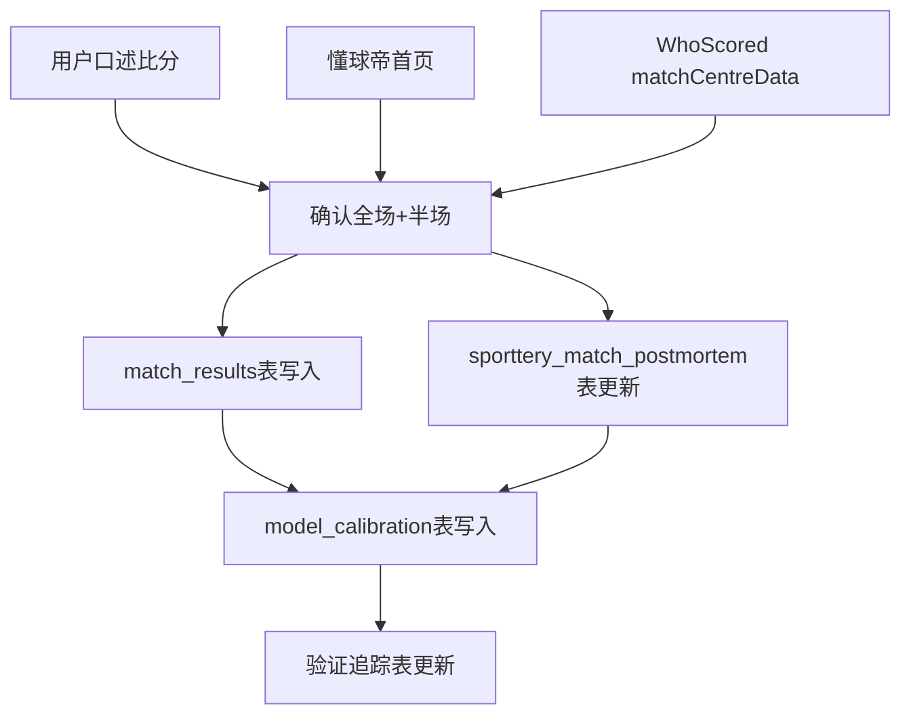

# 实时比赛数据采集方案

## 数据源优先级

### 赛后比分
1. **用户口述**（最可靠，优先录入）
2. **懂球帝(dongqiudi.com)** — curl直连，首页HTML含比分+进球详情
   ```
   curl https://www.dongqiudi.com/ | grep -oP '美国\d+-\d+巴拉圭'
   标题示例: "美国4-1巴拉圭，巴洛贡双响，普利希奇献助攻，麦肯尼造乌龙"
   ```
   提取模式: 搜索 `比赛名(\d+)[:-](\d+)` + 确认上下文含队名
3. **RSSSF (rsssf.org)** — curl直连，次日更新
4. **WhoScored** — 首次curl 200 OK，第二次403。需一次拉取完整HTML保存

### 实时赔率
- Sporttery API: ⚠️ DNS解析失败(store.sporttery.cn不可达)
- WhoScored 72场: 首次curl 200 OK，第二次403
- SPdex (op1.sp1x2.net): ✅ curl直连，需Cookie(已过期需刷新)
- 500.com: 反爬严格，不可靠

## 数据处理流程



## 赛后数据入库检查清单

- [ ] 全场比分（多源交叉验证）
- [ ] 半场比分（半全场验证需要）
- [ ] 进球详情（球员+时间）
- [ ] match_results表写入
- [ ] sporttery_match_postmortem表更新
- [ ] model_calibration表更新（校准参数）
- [ ] 验证追踪表（投注方案/验证追踪_YYYYMMDD.md）

## 关键文件路径

- WhoScored赛后数据: `球赛专属/数据/realTime/{team1}_vs_{team2}_ft.json`
- 验证追踪: `球赛专属/投注方案/验证追踪_20260613.md`
- 数据库: `球赛专属/数据/football_database.sqlite`

## pitfalls

- ❌ 不要只依赖WhoScored快照（可能过时，如美国vs巴拉圭2-0→实际4-1）
- ❌ Wikipedia超时/重定向不可用
- ❌ 500.com/sporttery无比分页面
- ✅ 懂球帝首页curl可直连（2026-06-13验证通过）
- 首次WhoScored curl成功后必须保存完整HTML再解析，二次请求会403